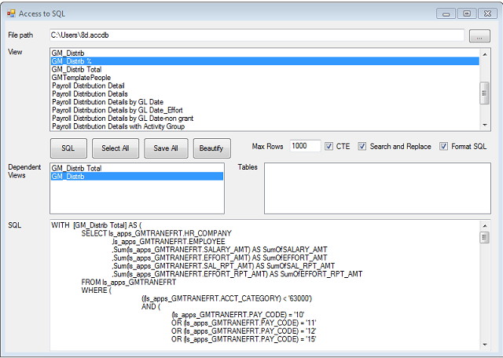

Originally posted here:
<https://www.codeproject.com/Articles/5246516/MS-Access-Queries-to-SQL-Server-Converter/>

### Introduction
To use this application, select Access file, Select a view and click SQL. Click Save All to save all Access queries as SQL files to a folder.



The result SQL will be created using CTE (Common Table Expressions) in case the Access query is using other Access queries. For example:

```SQL
With a as (
    select col1 +  col2 as col3
    From table1
)
Select col3
From a
In case Access query is using Access table, the table will be scripted as a CTE with UNION ALL clause. For example:

SQL
 With a as (
    select 1 as col1, 2 as col2 UNION ALL
    select 1 as col1, 2 as col2 
)
Select col1, col2
From a
Using the Code
```

The tool uses PoorMansTSqlFormatter to make SQL look prettier. To use it, make sure that the “Format SQL” option is checked. I used ILMerge (included in the download) to add PoorMansTSqlFormatterLib35.dll to the AccessToSql2.exe so that I can use it without an installation package.

Plain Text
```
C:\ILMerge.exe AccessToSql.exe PoorMansTSqlFormatterLib35.dll /out:AccessToSql2.exe
```

AccessView.vbs creates a CSV file to show all MS Access linked tables and queries.

AccessUpdate.vbs that will update a MS Access to point all linked tables and queries to another SQL Server location

